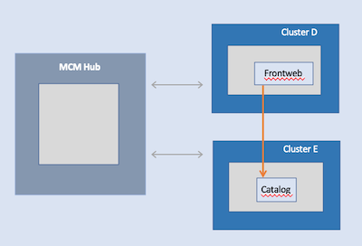
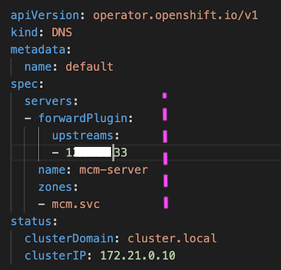
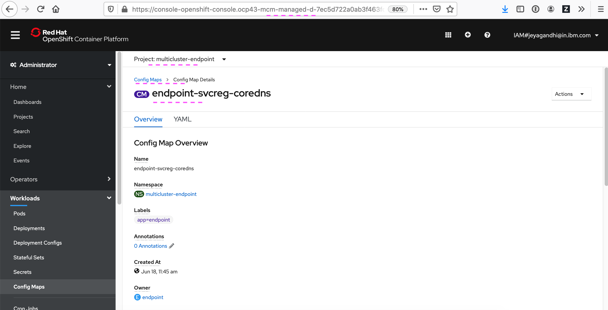
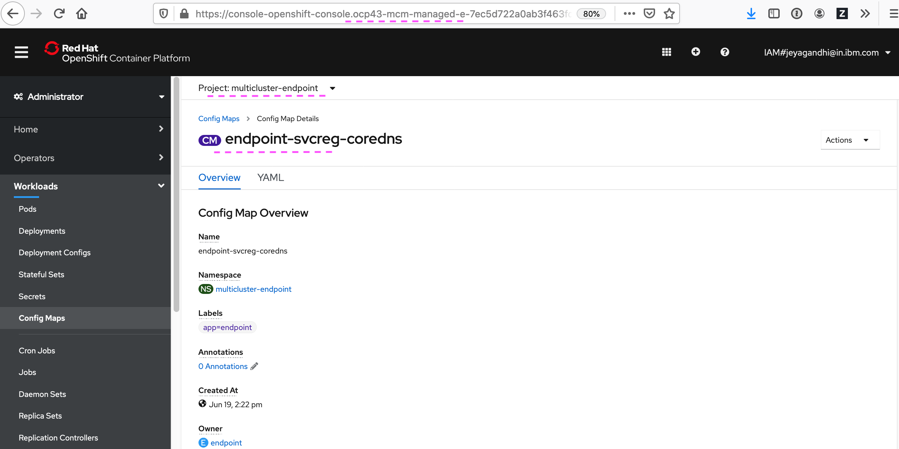
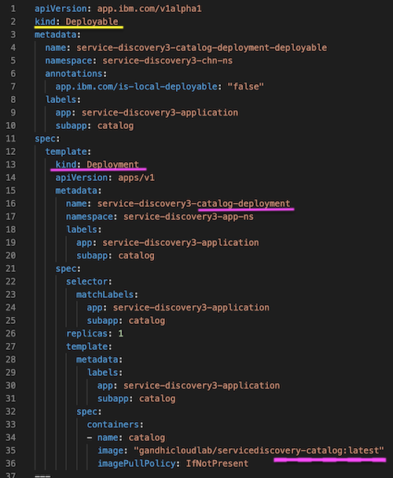
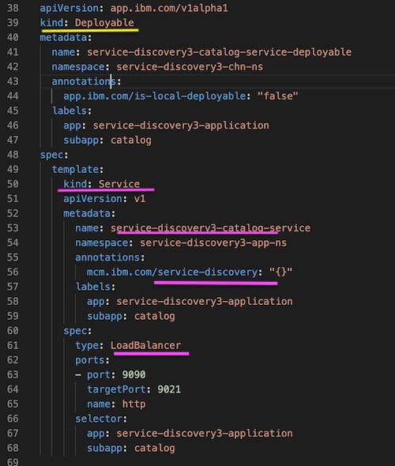
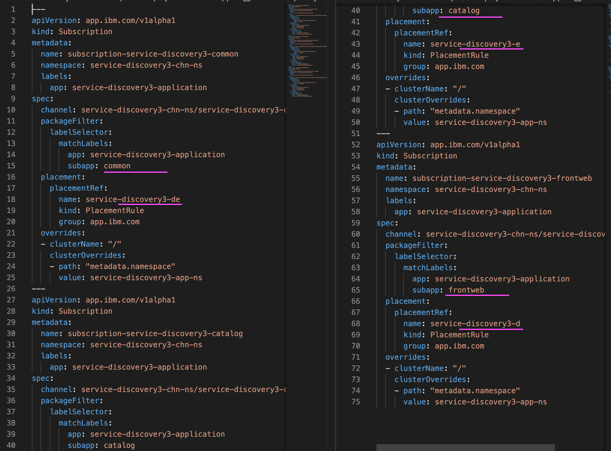

# MCM Service Discovery in OCP 4.3 Clusters

IBM Multicloud Manager provides feature to discover services among connected managed clusters. 

In this documentation we will see the following
- Configuring DNS in Managed Cluster for Service Discovery
- Installing a sample application 
- Kubernetes objects changes for Service Discovery

Versions used : 

IBM Multicloud Manager 1.3.0

Redhat Openshift Container Plantform 4.3

--------------

## Objective

The MCM Hub cluster is connected with 2 managed clusters `d` and `e`. Both the managed clusters are installed with Redhat Openshift Container Plantform 4.3.


The `frontend` service deployed in Cluster `d` is going to call `catalog` service in Cluster `e`.



--------------

## Configure DNS in Managed Cluster

Need to configure DNS in the Managed Cluster. 

The Knowledge Center page has the detailed explanation about how to do it. https://www.ibm.com/support/knowledgecenter/SSFC4F_1.3.0/mcm/services/mcm_serv_prep.html. But for OCP it is little different and it is explained here.


Do the followings steps in each of your managed cluster.

### 1. Get the Service Registry IP Address of the managed cluster

Run the below command. And you will get the service registry IP printed.

```
kubectl get -n multicluster-endpoint service mcm-svc-registry-dns -o jsonpath='{.spec.clusterIP}'
```

Lets assume that output is `111.222.333.444`.


### 2. Update dns.operator/default

#### 1. Run the below command to edit the `dns.operator`

```
oc edit dns.operator/default
```

#### 2. Add the below information under the spec and save.  

```
  servers:
  - forwardPlugin:
      upstreams:
      - << service registry IP>>
    name: mcm-server
    zones:
    - mcm.svc
```

The result would be like this.



#### 3. View the Configmap dns-default

The dns-default configmap automatically get created. Run the below command to see the config map.

```
kubectl get -n openshift-dns configmap dns-default -o yaml
```

The output could be like this.


#### 4. View the Configmap endpoint-svcreg-coredns

The endpoint-svcreg-coredns configmap automatically get created. Run the below command to see the config map.

```
kubectl get -n multicluster-endpoint configmap endpoint-svcreg-coredns -o yaml
```

The output could be like this.


#### 5. View the service mcm-svc-registry-dns

Run the below command to see that. 

```
oc describe svc mcm-svc-registry-dns -n multicluster-endpoint 
```

The output could be like this. Here the endpoints for the mentiond service would be empty. 


#### 6. Create workaround service

1. Run the below command to create a workaround service that will create with appropriate endpoints.

```
oc apply -f /files/svc.yaml
```

The svc.yaml file looks like this.


2. Run the below command to see the service with appropriate endpoints.

```
oc describe -n multicluster-endpoint service mcm-svc-registry-test
```
The output could be like this. 


Now this managed cluster is ready for the service discovery. 

You caan repeat the same to another managed cluster if any.

--------------

## Installing Sample App

### Installing application in Hub

#### 1. Login into mcm hub

Login to mcm hub in the command line window.

```
oc login ................
```

#### 2. Goto the install folder

Goto the `/deployment/install/` folder

#### 3. Install namespace

Run the below command.

```
sh 01-install-namespace.sh
```

#### 4. Install app

Run the below command.

```
sh 02-install-app.sh
```

### View the installed application

#### 1. MCM Application topology view at MCM Hub

It contains the cluster `d` and `e`.  As planned cluster `d` contains `frontweb` service and cluster `e` contains `catalog` service.


#### 2. frontweb pod in cluster d


#### 3. frontweb service in cluster d


#### 4. frontweb routes in cluster d


#### 5. endpoint-svcreg-coredns in cluster d

The DNS we confitured in the previous steps.




The same entry would exists in cluster `e` as well.

#### 6. catalog pod in cluster e


#### 7. catalog service in cluster e


#### 5. endpoint-svcreg-coredns in cluster d

It is same in all the cluters.




### Run the installed application

1. Goto the Routes Page in cluster `d`. 

2. Click on the route. It should open a application home page.


3. Click on the catalog link, it will show the output.


## Detailed view of Kubernetes Resources

#### 1. Catalog Deployment



This is a typical `Deployable` MCM resource for `Catalog` service. It contains `Deployment` Kubernetes resource inside.

Line No. 35: Container image

#### 2. Catalog Service



This is a typical `Deployable` MCM resource for `Catalog` service. It contains `Service` Kubernetes resource inside.

Line No. 56: The annodation `mcm.ibm.com/service-discovery: "{}"` to be added

Line No. 61: The Type should be `LoadBalancer`

#### 3. Frontweb Deployment


This is a typical `Deployable` MCM resource for `FrontWeb` service. It contains `Deployment` Kubernetes resource inside. 

Line No. 35: Container image

Line No. 38, 41: Service Discovery url to call `Catalog` service is passed from the configmap.

Line No. 43: Dependencies is declared here. Here `FrontWeb` is depend on `Catalog` service.

Line No. 47: Placement is declared here. It means that the `FrontWeb` to be deployed in cluster `d` 

#### 4. Configmap


This configmap is deployed in both the clusters `d`.  This properties form this configmap is used in `FrontWeb` service.

Line No. 23: URL mentioned here is the URL to discover the `Catalog` service.

The format is ServiceName.Namespace.mcm.svc

#### 5. Channel


#### 6. Placement


Placement rules defining the  clusters `d` and  `e`.  

#### 7. Subscription



Subscriptions connecting the kubernetes resources `Deployment`, `Services` and `Routes`  defined for  clusters `d` and  `e`.  

#### 8. Namespace

